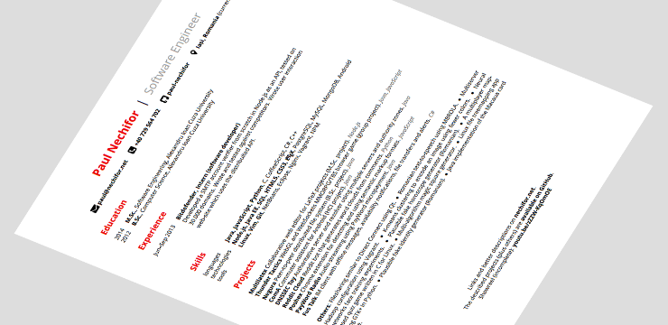

# CV

[Paul Nechifor][hp]'s CV generator. Get the most recent PDF in the [releases
page][releases].

This generator uses [my CV info][cvinfo] for the data. You need `pdflatex` in
order to compile it.

## Usage

Get the submodule:

    git submodule init
    git submodule update

Install NPM packages:

    npm install

Build everything:

    make

## License

MIT

[hp]: http://nechifor.net
[releases]: https://github.com/paul-nechifor/cv/releases
[cvinfo]: https://github.com/paul-nechifor/nechifor-info
